# Multi-Agent Conversation System - Comprehensive Analysis
## SMS Conversation Flow with 4-Agent Architecture

**Date:** December 9, 2025  
**Focus:** Multi-agent conversation system (SMS channel)  
**Architecture:** Planner → Timesheet → Branding → Quality (with refinement loop)

---

## 🎯 **Executive Summary**

### **System Philosophy**

The current multi-agent system follows a **pure LLM-driven orchestration** philosophy:

1. ✅ **Agents communicate via natural language** - No hardcoded message formats
2. ✅ **NO hardcoded orchestration** - No query type enums or switch statements
3. ✅ **Workflow is just a message router** - Temporal workflow only routes messages between agents
4. ✅ **All decisions made by LLM prompts** - Each agent uses LLM to decide what to do
5. ✅ **Quality control with scorecard validation** - Automated quality assurance
6. ✅ **Refinement loop** - Automatic improvement if validation fails

### **Key Advantages Over Single-Agent**

| Feature | Single-Agent | Multi-Agent | Advantage |
|---------|-------------|-------------|-----------|
| **Separation of Concerns** | ❌ All in one prompt | ✅ 4 specialized agents | Better maintainability |
| **Quality Control** | ❌ No validation | ✅ Scorecard-based QA | Guaranteed quality |
| **Refinement** | ❌ No retry | ✅ Automatic refinement | Self-improving |
| **Channel Formatting** | ❌ Manual | ✅ Dedicated agent | Consistent branding |
| **Tool Selection** | ❌ Hardcoded | ✅ LLM decides | More flexible |
| **Graceful Failures** | ❌ Generic errors | ✅ Contextual messages | Better UX |
| **Observability** | ⚠️ Basic | ✅ Per-agent tracing | Better debugging |
| **Testability** | ⚠️ E2E only | ✅ Per-agent testing | Easier testing |

---

## 📊 **System Architecture Overview**

### **4-Agent Team**

```
┌─────────────────────────────────────────────────────────────────┐
│                    MULTI-AGENT TEAM                              │
├─────────────────────────────────────────────────────────────────┤
│                                                                  │
│  1. PLANNER AGENT (Coordinator)                                 │
│     - Analyzes user request                                     │
│     - Creates execution plan                                    │
│     - Generates scorecard for quality validation                │
│     - Composes final response from data                         │
│     - Handles refinement requests                               │
│     - Composes graceful failure messages                        │
│                                                                  │
│  2. TIMESHEET AGENT (Data Specialist)                           │
│     - Receives natural language instruction from Planner        │
│     - Uses LLM to decide which of 51 Harvest tools to call      │
│     - Executes tool with extracted parameters                   │
│     - Returns structured data to Planner                        │
│                                                                  │
│  3. BRANDING AGENT (Formatter)                                  │
│     - Receives channel-agnostic response from Planner           │
│     - Uses LLM to format for specific channel (SMS/Email/etc)   │
│     - Applies style guide and brand voice                       │
│     - Handles message splitting for length limits               │
│                                                                  │
│  4. QUALITY AGENT (Validator)                                   │
│     - Validates response against scorecard criteria             │
│     - Evaluates each criterion (pass/fail)                      │
│     - Provides specific feedback for failures                   │
│     - Triggers refinement if validation fails                   │
│     - Approves graceful failure messages                        │
│                                                                  │
└─────────────────────────────────────────────────────────────────┘
```

### **Agent Communication Pattern**

```
Planner → Timesheet: "Get time entries for November 18-24, 2025"
Timesheet → Planner: {harvest_response: {...}, tool_used: "list_time_entries"}
Planner → Branding: "You logged 40 hours last week across 3 projects..."
Branding → Quality: "You logged 40 hours last week across 3 projects: Alpha (20h), Beta (15h), Gamma (5h)."
Quality → Planner: FAIL - {criteria: ["data_completeness"], feedback: "Missing project details"}
Planner → Branding: "You logged 40 hours last week: Alpha Project (20h), Beta Project (15h), Gamma Project (5h)."
Branding → Quality: "You logged 40 hours last week: Alpha Project (20h), Beta Project (15h), Gamma Project (5h)."
Quality → Workflow: PASS
```

---

## 🔄 **Complete SMS Conversation Flow - Sequence Diagram**

```mermaid
sequenceDiagram
    participant User as User's Phone<br/>(Sends SMS)
    participant Twilio as Twilio Webhook<br/>(Receives SMS)
    participant Server as Temporal Worker<br/>(unified_server.py)
    participant Workflow as MultiAgentWorkflow<br/>(Temporal workflow)
    participant Planner as Planner Agent<br/>(Coordinator)
    participant Timesheet as Timesheet Agent<br/>(Data Specialist)
    participant Branding as Branding Agent<br/>(Formatter)
    participant Quality as Quality Agent<br/>(Validator)
    participant DB as Supabase Database<br/>(Storage)
    participant LLM as LLM Client<br/>(Centralized)
    participant MCP as Harvest MCP<br/>(External API)

    %% User sends SMS
    User->>Twilio: Send SMS<br/>"Check my timesheet"
    Twilio->>Server: POST /webhook/sms<br/>phone, message, SMS_SID
    
    activate Server
    Note over Server: Parse webhook data
    Server->>DB: Query user by phone number
    DB-->>Server: user_id, credentials, timezone
    
    Server->>Workflow: Start MultiAgentConversationWorkflow<br/>user_id, message, channel=SMS
    deactivate Server
    
    activate Workflow
    Note over Workflow: STEP 0: ENRICH CONTEXT
    Workflow->>DB: Get user credentials (if not provided)
    DB-->>Workflow: harvest_account, harvest_token, timezone
    Workflow->>Workflow: Add current_date from workflow.now()
    
    Note over Workflow: STEP 1: PLANNER ANALYZES REQUEST
    Workflow->>Planner: analyze_request()<br/>user_message, channel, history, context
    
    activate Planner
    Note over Planner: Check if SOP matches
    Planner->>Planner: Match against SOPs<br/>(check_timesheet, weekly_summary, etc)
    
    alt SOP Match Found
        Note over Planner: Use SOP template
        Planner->>Planner: Use predefined message_to_timesheet<br/>and criteria from SOP
    else No SOP Match
        Note over Planner: Use LLM to analyze
        Planner->>LLM: "Analyze this request and decide<br/>if you need timesheet data"
        LLM-->>Planner: {needs_data: true,<br/>message_to_timesheet: "...",<br/>criteria: [...]}
    end
    
    Planner-->>Workflow: execution_plan + scorecard
    deactivate Planner
    
    alt Needs Data = TRUE
        Note over Workflow: STEP 2: TIMESHEET EXTRACTS DATA
        Workflow->>Timesheet: execute()<br/>planner_message (natural language)
        
        activate Timesheet
        Note over Timesheet: Use LLM to decide tool
        Timesheet->>LLM: "Which of 51 Harvest tools<br/>should I call for this request?"
        LLM-->>Timesheet: {tool: "list_time_entries",<br/>args: {from_date: "...", to_date: "..."}}
        
        Timesheet->>Timesheet: Find tool by name
        Timesheet->>MCP: POST /api/list_time_entries<br/>credentials, date range
        
        activate MCP
        MCP->>MCP: Call Harvest API
        MCP-->>Timesheet: {time_entries: [...],<br/>total_hours: 40}
        deactivate MCP
        
        Timesheet-->>Workflow: {success: true,<br/>data: harvest_response,<br/>tool_used: "list_time_entries"}
        deactivate Timesheet
        
    else Needs Data = FALSE
        Note over Workflow: Skip Timesheet Agent
        Workflow->>Workflow: timesheet_data = None
    end
    
    Note over Workflow: STEP 3: PLANNER COMPOSES RESPONSE
    Workflow->>Planner: compose_response()<br/>user_message, timesheet_data, history
    
    activate Planner
    alt Has Timesheet Data
        Note over Planner: Data-driven response
        Planner->>LLM: "Compose response using this data:<br/>{harvest_response}"
        LLM-->>Planner: "You logged 40 hours last week<br/>across 3 projects..."
    else No Timesheet Data
        Note over Planner: Conversational response
        Planner->>LLM: "Respond to: {user_message}<br/>using conversation history"
        LLM-->>Planner: "Hello! How can I help you<br/>with your timesheet today?"
    end
    
    Planner-->>Workflow: {response: "..."}
    deactivate Planner
    
    Note over Workflow: STEP 4: BRANDING FORMATS FOR CHANNEL
    Workflow->>Branding: format_for_channel()<br/>response, channel=SMS
    
    activate Branding
    Note over Branding: Use LLM to format
    Branding->>LLM: "Format this for SMS:<br/>max 1600 chars, plain text,<br/>no markdown, concise"
    LLM-->>Branding: {formatted_content: "...",<br/>is_split: false}
    
    Branding-->>Workflow: {formatted_response: {...}}
    deactivate Branding
    
    Note over Workflow: STEP 5: QUALITY VALIDATES
    Workflow->>Quality: validate_response()<br/>formatted_response, scorecard
    
    activate Quality
    Note over Quality: Evaluate each criterion
    loop For each criterion in scorecard
        Quality->>LLM: "Does this response meet<br/>criterion: {criterion.description}?"
        LLM-->>Quality: {passed: true/false,<br/>feedback: "..."}
        Quality->>Quality: Update criterion.passed
    end
    
    Quality->>Quality: overall_passed = all criteria passed
    Quality-->>Workflow: {validation_result: {passed: true/false},<br/>failed_criteria: [...]}
    deactivate Quality
    
    alt Validation FAILED
        Note over Workflow: STEP 6: REFINEMENT LOOP (max 1 attempt)
        Workflow->>Planner: refine_response()<br/>original_response, failed_criteria
        
        activate Planner
        Planner->>LLM: "Refine this response to fix:<br/>{failed_criteria feedback}"
        LLM-->>Planner: {refined_response: "..."}
        Planner-->>Workflow: {refined_response: "..."}
        deactivate Planner
        
        Note over Workflow: Re-format refined response
        Workflow->>Branding: format_for_channel()<br/>refined_response, channel=SMS
        activate Branding
        Branding->>LLM: "Format this for SMS..."
        LLM-->>Branding: {formatted_content: "..."}
        Branding-->>Workflow: {formatted_response: {...}}
        deactivate Branding
        
        Note over Workflow: Re-validate
        Workflow->>Quality: validate_response()<br/>formatted_response, scorecard
        activate Quality
        Quality->>Quality: Evaluate criteria again
        Quality-->>Workflow: {validation_result: {passed: true/false}}
        deactivate Quality
        
        alt Still FAILED after refinement
            Note over Workflow: STEP 7: GRACEFUL FAILURE
            Workflow->>Planner: compose_graceful_failure()<br/>reason="validation_failed"
            activate Planner
            Planner->>LLM: "Compose graceful failure message"
            LLM-->>Planner: "I apologize, I'm having trouble<br/>processing your request..."
            Planner-->>Workflow: {failure_message: "..."}
            deactivate Planner
            
            Workflow->>Quality: validate_graceful_failure()<br/>failure_message
            activate Quality
            Quality->>Quality: Check failure message quality
            Quality-->>Workflow: Approved
            deactivate Quality
            
            Workflow->>Workflow: final_response = failure_message
        end
    end
    
    Note over Workflow: STEP 8: SEND RESPONSE VIA TWILIO
    Workflow->>Server: send_sms_response_activity()<br/>to_number, final_response
    
    activate Server
    Server->>Twilio: client.messages.create()<br/>body=final_response
    Twilio->>User: Deliver SMS to phone
    Twilio-->>Server: {message_sid: "...", status: "sent"}
    Server-->>Workflow: {success: true, message_sid: "..."}
    deactivate Server
    
    Note over Workflow: STEP 9: STORE CONVERSATION
    Workflow->>DB: Store INBOUND message<br/>user_id, content, platform=SMS
    DB-->>Workflow: Stored
    Workflow->>DB: Store OUTBOUND message<br/>user_id, response, platform=SMS
    DB-->>Workflow: Stored
    
    Note over Workflow: STEP 10: LOG METRICS
    Workflow->>Workflow: Log conversation metrics<br/>channel, message_length, response_length
    
    Note over Workflow: STEP 11: RETURN RESULT
    Workflow-->>Server: {request_id, final_response,<br/>validation_passed, refinement_attempted}
    deactivate Workflow
    
    Note over User: User receives response on phone
```



---

## 🔍 **Detailed Component Analysis**

### **1. Planner Agent - The Coordinator**

**File:** `agents/planner.py` (670 lines)

#### **Responsibilities:**

1. ✅ **Analyze user requests** - Understand what user wants
2. ✅ **Create execution plans** - Decide if data is needed
3. ✅ **Generate scorecards** - Define quality criteria
4. ✅ **Compose responses** - Combine data with context
5. ✅ **Handle refinement** - Improve failed responses
6. ✅ **Graceful failures** - Compose error messages

#### **Key Features:**

**A. Standard Operating Procedures (SOPs)**

```python
sops = {
    "check_timesheet": {
        "triggers": ["check timesheet", "my timesheet", "hours logged", ...],
        "needs_data": True,
        "message_to_timesheet": "Execute list_time_entries tool: ...",
        "criteria": [
            {"id": "data_completeness", "description": "...", "expected": "..."},
            {"id": "time_period_clarity", "description": "...", "expected": "..."},
            {"id": "sms_format", "description": "...", "expected": "..."}
        ]
    },
    "weekly_summary": {...},
    "today_entries": {...},
    "last_entry": {...},
    ...
}
```

**Advantage:** Pre-defined workflows for common queries = faster + more consistent

**B. LLM-Driven Analysis (when no SOP matches)**

```python
prompt = f"""You are a Planner Agent coordinating a multi-agent team.

User's request: "{user_message}"
Channel: {channel}

Available agents:
- Timesheet Agent: Can retrieve data from Harvest API (51 tools available)
- Branding Agent: Can format responses for different channels
- Quality Agent: Can validate response quality

Your task:
1. Analyze the user's request
2. Decide if you need data from the Timesheet Agent
3. If yes, write a clear, specific message to the Timesheet Agent
4. Create quality validation criteria

Return JSON:
{{
    "needs_data": true/false,
    "message_to_timesheet": "...",
    "criteria": [...]
}}
"""
```

**Advantage:** Handles novel queries that don't match SOPs

**C. Response Composition**

```python
async def compose_response(
    self,
    request_id: str,
    user_message: str,
    timesheet_data: Dict[str, Any],
    conversation_history: List[Dict],
    user_context: Dict[str, Any]
) -> Dict[str, Any]:
    """Compose response from timesheet data and context"""
    
    if timesheet_data:
        # Data-driven response
        prompt = f"""Compose a response using this Harvest data:
        {harvest_response}
        
        User asked: "{user_message}"
        """
    else:
        # Conversational response
        prompt = f"""Respond to: "{user_message}"
        Using conversation history: {conversation_history}
        """
    
    response = await self.llm_client.generate(prompt)
    return {"response": response}
```

**Advantage:** Context-aware responses using conversation history

---

### **2. Timesheet Agent - The Data Specialist**

**File:** `agents/timesheet.py` (352 lines)

#### **Responsibilities:**

1. ✅ **Receive natural language instructions** from Planner
2. ✅ **Use LLM to decide which tool to call** (out of 51 Harvest tools)
3. ✅ **Extract parameters** from instruction
4. ✅ **Execute tool** via Harvest MCP
5. ✅ **Return structured data** to Planner

#### **Key Features:**

**A. LLM-Driven Tool Selection**

```python
prompt = f"""You are a Timesheet Tool Execution Specialist with access to ALL 51 Harvest API tools.

PLANNER'S INSTRUCTION:
"{planner_message}"

CONTEXT:
- User's timezone: {user_context.get('timezone', 'UTC')}
- Today's date: {user_context.get('current_date', 'unknown')}

COMPLETE HARVEST API TOOL CATALOG (51 tools):

TIME ENTRIES (7 tools):
- list_time_entries(from_date, to_date, user_id=None)
- get_time_entry(time_entry_id)
- create_time_entry(project_id, task_id, spent_date, hours, notes=None)
...

PROJECTS (5 tools):
- list_projects(is_active=None, client_id=None)
- get_project(project_id)
...

[Full catalog of 51 tools]

Your task:
1. Understand what the Planner is asking for
2. Decide which tool to call
3. Extract parameters from the instruction
4. Return tool name and arguments

Return JSON:
{{
    "tool_name": "list_time_entries",
    "tool_args": {{
        "from_date": "2025-11-18",
        "to_date": "2025-11-24"
    }}
}}
"""
```

**Advantage:** No hardcoded query type enums - LLM decides dynamically

**B. Tool Execution**

```python
# Find tool by name
for tool in self.harvest_tools:
    if tool.name == tool_name:
        # Execute tool
        result = await tool.ainvoke(tool_args)
        
        return {
            "success": True,
            "data": {
                "harvest_response": result,
                "query_parameters": tool_args,
                "tool_used": tool_name
            }
        }
```

**Advantage:** Reuses existing 51 Harvest tools without modification

---

### **3. Branding Agent - The Formatter**

**File:** `agents/branding.py` (399 lines)

#### **Responsibilities:**

1. ✅ **Format responses for specific channels** (SMS, Email, WhatsApp, Teams)
2. ✅ **Apply style guide** (tone, emojis, humor)
3. ✅ **Handle message splitting** for length limits
4. ✅ **Remove/apply markdown** based on channel capabilities

#### **Key Features:**

**A. Channel-Specific Formatting**

```python
prompt = f"""You are a Branding Specialist formatting responses for different communication channels.

Response to format:
"{response}"

Channel: {channel_key}

Channel requirements and constraints:
- SMS: Plain text only, max 1600 characters, no markdown, be concise and clear
- Email: Full markdown supported, no length limit, can be detailed and formatted
- WhatsApp: Limited markdown (*bold*, _italic_), max 4000 characters, friendly tone
- Teams: Structured content, markdown supported, professional tone

Brand voice: Professional but friendly, clear and helpful

Your task:
1. Format the response appropriately for {channel_key}
2. Apply the brand voice
3. Ensure it meets channel constraints (length, formatting)
4. If too long, intelligently truncate or split

Return JSON:
{{
    "formatted_content": "the formatted response text",
    "is_split": false,
    "parts": ["part1", "part2"] // if split
}}
"""
```

**Advantage:** Consistent branding across all channels

**B. Configuration-Driven**

```yaml
# agents/config/style_guide.yaml
tone: professional_friendly
emojis: minimal
humor: subtle
formality: medium

# agents/config/channels.yaml
sms:
  max_length: 1600
  markdown: false
  formatting: plain_text
  
email:
  max_length: null
  markdown: true
  formatting: full_html
```

**Advantage:** Easy to update style without code changes

---

### **4. Quality Agent - The Validator**

**File:** `agents/quality.py` (259 lines)

#### **Responsibilities:**

1. ✅ **Validate responses** against scorecard criteria
2. ✅ **Evaluate each criterion** as boolean pass/fail
3. ✅ **Provide specific feedback** for failed criteria
4. ✅ **Trigger refinement** when validation fails
5. ✅ **Approve graceful failure messages**
6. ✅ **Log all validation failures**

#### **Key Features:**

**A. Scorecard-Based Validation**

```python
async def validate_response(
    self,
    request_id: str,
    response: str,
    scorecard: Dict[str, Any],
    channel: str,
    original_question: str
) -> Dict[str, Any]:
    """Validate response against scorecard criteria"""
    
    scorecard_obj = Scorecard(**scorecard)
    
    # Evaluate each criterion
    for criterion in scorecard_obj.criteria:
        passed, feedback = await self._evaluate_criterion(
            criterion, response, channel, original_question
        )
        criterion.passed = passed
        criterion.feedback = feedback
    
    # Overall evaluation
    overall_passed = scorecard_obj.evaluate()  # All must pass
    failed_criteria = scorecard_obj.get_failed_criteria()
    
    return {
        "validation_result": {
            "passed": overall_passed,
            "scorecard_id": scorecard_obj.request_id,
            "failed_criteria_ids": [c.id for c in failed_criteria]
        },
        "failed_criteria": [c.model_dump() for c in failed_criteria]
    }
```

**Advantage:** Automated quality assurance before sending

**B. LLM-Driven Criterion Evaluation**

```python
async def _evaluate_criterion(
    self,
    criterion: ScorecardCriterion,
    response: str,
    channel: str,
    original_question: str
) -> tuple[bool, str]:
    """Evaluate a single criterion using LLM"""
    
    prompt = f"""You are a Quality Assurance Specialist.

CRITERION TO EVALUATE:
ID: {criterion.id}
Description: {criterion.description}
Expected: {criterion.expected}

RESPONSE TO VALIDATE:
"{response}"

CONTEXT:
- Channel: {channel}
- Original question: "{original_question}"

Your task:
Evaluate if the response meets this criterion.

Return JSON:
{{
    "passed": true/false,
    "feedback": "specific feedback if failed"
}}
"""
    
    result = await self.llm_client.generate(prompt)
    return result["passed"], result.get("feedback", "")
```

**Advantage:** Flexible validation criteria per request

---

## 🔄 **Workflow Orchestration**

**File:** `unified_workflows.py` - `MultiAgentConversationWorkflow` (lines 3505-3806)

### **Workflow Steps:**

```python
@workflow.defn
class MultiAgentConversationWorkflow:
    """
    Philosophy:
    - Agents communicate via natural language
    - NO hardcoded orchestration or query types
    - Workflow is just a message router
    - All decisions made by LLM prompts
    """
    
    @workflow.run
    async def run(self, user_message, channel, user_id, ...):
        
        # STEP 0: Enrich user context
        credentials = await get_user_credentials_activity(user_id)
        user_context["credentials"] = credentials
        user_context["current_date"] = workflow.now().strftime("%Y-%m-%d")
        
        # STEP 1: Planner analyzes request
        plan_result = await planner_analyze_activity(
            request_id, user_message, channel, conversation_history, user_context
        )
        execution_plan = plan_result["execution_plan"]
        scorecard = plan_result["scorecard"]
        
        # STEP 2: Timesheet extracts data (if needed)
        timesheet_data = None
        if execution_plan.get("needs_data"):
            planner_message = execution_plan.get("message_to_timesheet")
            timesheet_result = await timesheet_execute_activity(
                request_id, planner_message, user_context
            )
            if timesheet_result.get("success"):
                timesheet_data = timesheet_result.get("data")
            else:
                # Graceful failure
                failure_result = await planner_graceful_failure_activity(...)
                return {"final_response": failure_result["failure_message"], ...}
        
        # STEP 3: Planner composes response
        compose_result = await planner_compose_activity(
            request_id, user_message, timesheet_data, conversation_history, user_context
        )
        response = compose_result["response"]
        
        # STEP 4: Branding formats for channel
        branding_result = await branding_format_activity(
            request_id, response, channel, user_context
        )
        formatted_response = branding_result["formatted_response"]
        
        # STEP 5: Quality validates
        validation_result = await quality_validate_activity(
            request_id, formatted_response["content"], scorecard, channel, user_message
        )
        validation = validation_result["validation_result"]
        failed_criteria = validation_result.get("failed_criteria", [])
        
        # STEP 6: Refinement if needed (max 1 attempt)
        if not validation["passed"]:
            # Refine
            refine_result = await planner_refine_activity(
                request_id, response, failed_criteria, 1
            )
            refined_response = refine_result["refined_response"]
            
            # Reformat
            rebranding_result = await branding_format_activity(
                request_id, refined_response, channel, user_context
            )
            formatted_response = rebranding_result["formatted_response"]
            
            # Revalidate
            revalidation_result = await quality_validate_activity(
                request_id, formatted_response["content"], scorecard, channel, user_message
            )
            validation = revalidation_result["validation_result"]
        
        # STEP 7: Graceful failure if still not passed
        final_response = formatted_response["content"]
        if not validation["passed"]:
            failure_result = await planner_graceful_failure_activity(
                request_id, user_message, "validation_failed", channel
            )
            final_response = failure_result["failure_message"]
        
        # STEP 8: Send response via SMS
        await send_sms_response_activity(to_number, final_response, request_id)
        
        # STEP 9: Store conversation
        await store_conversation(user_id, user_message, final_response, channel, ...)
        
        # STEP 10: Log metrics
        await log_conversation_metrics(channel, len(user_message), len(final_response))
        
        # STEP 11: Return result
        return {
            "request_id": request_id,
            "final_response": final_response,
            "validation_passed": validation["passed"],
            "refinement_attempted": refinement_count > 0,
            "graceful_failure": graceful_failure
        }
```

### **Workflow Advantages:**

1. ✅ **Temporal reliability** - Automatic retries, durability
2. ✅ **Deterministic execution** - `workflow.now()` for consistent timestamps
3. ✅ **Activity isolation** - Each agent runs in separate activity
4. ✅ **Timeout protection** - Per-activity timeouts
5. ✅ **Retry policies** - Configurable retry for each step
6. ✅ **Observability** - Temporal UI shows full execution history

---

## 📊 **Data Flow Analysis**

### **Message Transformations:**

```
1. User SMS → Twilio Webhook
   Input: "Check my timesheet"
   Format: {From: "+61...", Body: "Check my timesheet", MessageSid: "SM..."}

2. Webhook → Workflow
   Input: user_id, message, channel=SMS, conversation_id
   Format: ConversationRequest(user_id="uuid", message="Check my timesheet", platform="sms")

3. Workflow → Planner (Analyze)
   Input: request_id, user_message, channel, conversation_history, user_context
   Output: {execution_plan: {...}, scorecard: {...}}

4. Planner → Timesheet (if needs_data)
   Input: request_id, "Get time entries for this week", user_context
   Output: {success: true, data: {harvest_response: {...}, tool_used: "list_time_entries"}}

5. Timesheet → MCP
   Input: {harvest_account, harvest_token, from_date, to_date}
   Output: {time_entries: [...], total_hours: 40}

6. Planner → Branding (Compose)
   Input: request_id, user_message, timesheet_data, conversation_history
   Output: {response: "You logged 40 hours last week across 3 projects..."}

7. Branding → Quality (Format)
   Input: request_id, response, channel=SMS
   Output: {formatted_response: {content: "...", is_split: false}}

8. Quality → Workflow (Validate)
   Input: request_id, formatted_response, scorecard, channel
   Output: {validation_result: {passed: true}, failed_criteria: []}

9. Workflow → Twilio (Send)
   Input: to_number, final_response
   Output: {message_sid: "SM...", status: "sent"}

10. Workflow → Supabase (Store)
    Input: user_id, message, response, platform=SMS
    Output: {status: "success", records: 2}
```

---

## 🎯 **Key Advantages of Multi-Agent System**

### **1. Separation of Concerns**

**Single-Agent:**
```python
# All in one giant prompt
prompt = """You are a timesheet assistant.
1. Analyze the request
2. Decide if you need data
3. Call the right tool
4. Format for SMS (max 1600 chars)
5. Make sure it's high quality
6. Handle errors gracefully
...
"""
```

**Multi-Agent:**
```python
# Each agent has ONE job
Planner: "Analyze and decide"
Timesheet: "Get data"
Branding: "Format for channel"
Quality: "Validate quality"
```

**Advantage:** Easier to maintain, test, and debug

---

### **2. Quality Control**

**Single-Agent:**
- ❌ No validation
- ❌ Hope LLM gets it right
- ❌ No retry mechanism

**Multi-Agent:**
- ✅ Scorecard-based validation
- ✅ Automatic refinement if failed
- ✅ Graceful failure messages
- ✅ Quality logs for analysis

**Advantage:** Guaranteed quality before sending

---

### **3. Refinement Loop**

**Single-Agent:**
```
User → LLM → Response (hope it's good)
```

**Multi-Agent:**
```
User → Planner → Branding → Quality
                              ↓ FAIL
                    Planner ← Refine
                              ↓
                    Branding → Format
                              ↓
                    Quality → Validate
                              ↓ PASS
                    Send to user
```

**Advantage:** Self-improving responses

---

### **4. Channel-Specific Formatting**

**Single-Agent:**
```python
# Manual truncation
if len(response) > 1600:
    response = response[:1597] + "..."
```

**Multi-Agent:**
```python
# Intelligent formatting by Branding Agent
Branding Agent:
- Understands channel constraints
- Applies style guide
- Splits messages intelligently
- Removes/adds markdown appropriately
```

**Advantage:** Consistent branding across all channels

---

### **5. Tool Selection Flexibility**

**Single-Agent:**
```python
# Hardcoded query types
if "check" in message and "timesheet" in message:
    tool = "list_time_entries"
elif "log" in message:
    tool = "create_time_entry"
...
```

**Multi-Agent:**
```python
# LLM decides dynamically
Timesheet Agent:
- Receives natural language instruction
- Uses LLM to choose from 51 tools
- Extracts parameters intelligently
- No hardcoded logic
```

**Advantage:** Handles novel queries better

---

### **6. Graceful Failures**

**Single-Agent:**
```python
# Generic error
return "Sorry, something went wrong."
```

**Multi-Agent:**
```python
# Contextual failure messages
Planner composes graceful failure:
- "I'm having trouble accessing your timesheet data right now. Please try again in a moment."
- "I couldn't find any time entries for that period. Would you like to log some hours?"
- "I need more information to help you. Could you specify which project?"

Quality validates failure message:
- Ensures it's helpful
- Ensures it's appropriate for channel
- Ensures it doesn't expose errors
```

**Advantage:** Better user experience

---

### **7. Observability**

**Single-Agent:**
```
User → LLM → Response
(Black box)
```

**Multi-Agent:**
```
User → Planner (logged)
     → Timesheet (logged, tool used, parameters)
     → Branding (logged, formatting applied)
     → Quality (logged, validation result, failed criteria)
     → Refinement (logged, attempt count)
     → Send (logged, message_sid)
```

**Advantage:** Full visibility into decision-making

---

### **8. Testability**

**Single-Agent:**
```python
# Only E2E testing
test_conversation("check timesheet")
# Hard to test individual components
```

**Multi-Agent:**
```python
# Per-agent testing
test_planner_analysis()
test_timesheet_tool_selection()
test_branding_sms_formatting()
test_quality_validation()
test_refinement_loop()

# Integration testing
test_full_workflow()
```

**Advantage:** Easier to test and debug

---

## 📈 **Performance Comparison**

### **LLM Calls:**

**Single-Agent:**
```
1 LLM call: Generate response with tools
(If tool needed: 1 additional call to format tool result)
Total: 1-2 LLM calls
```

**Multi-Agent:**
```
1. Planner analyze: 1 LLM call (or 0 if SOP matches)
2. Timesheet execute: 1 LLM call (to decide tool)
3. Planner compose: 1 LLM call (to compose response)
4. Branding format: 1 LLM call (to format)
5. Quality validate: N LLM calls (1 per criterion, typically 3-5)
6. Refinement (if needed): +3 LLM calls (refine, reformat, revalidate)

Total: 7-10 LLM calls (without refinement)
Total: 10-13 LLM calls (with refinement)
```

**Trade-off:**
- ❌ More LLM calls = higher cost + latency
- ✅ Better quality = fewer user complaints
- ✅ Automatic refinement = better UX
- ✅ Validation = guaranteed quality

**Optimization Opportunities:**
1. ✅ **SOPs reduce Planner LLM calls** - Common queries use templates
2. ✅ **Caching** - LLM client caches responses
3. ✅ **Parallel execution** - Some steps could run in parallel
4. ⚠️ **Criterion batching** - Validate multiple criteria in one LLM call

---

## 🔧 **System Integration Points**

### **1. Temporal Workflow Engine**

```python
# Workflow execution
workflow_handle = await temporal_client.start_workflow(
    MultiAgentConversationWorkflow.run,
    args=[user_message, channel, user_id, conversation_id, ...],
    id=f"conversation-{conversation_id}",
    task_queue="unified-task-queue"
)

result = await workflow_handle.result()
```

**Advantages:**
- ✅ Automatic retries
- ✅ Durable execution
- ✅ Workflow history
- ✅ Timeout protection

---

### **2. Centralized LLM Client**

```python
# All agents use the same LLM client
llm_response = await self.llm_client.generate(prompt)

# Features:
- Rate limiting (per-tenant, per-user)
- Response caching
- Opik tracing
- Cost tracking
- JSON minification
- Error handling with retries
- Fallback models
```

**Advantages:**
- ✅ Consistent LLM interaction
- ✅ Centralized observability
- ✅ Cost optimization
- ✅ Multi-tenant support

---

### **3. Harvest MCP Server**

```python
# Timesheet Agent calls MCP
result = await call_harvest_mcp_tool(tool_name, payload)

# MCP handles:
- Harvest API authentication
- Rate limiting
- Error handling
- Response formatting
```

**Advantages:**
- ✅ Separation of concerns
- ✅ Reusable across agents
- ✅ Centralized Harvest logic

---

### **4. Supabase Database**

```python
# Conversation storage
await store_conversation(
    user_id, message, response, platform, conversation_id
)

# Schema:
- users: User profiles and credentials
- conversations: Conversation metadata
- conversation_context: Message history (INBOUND/OUTBOUND)
```

**Advantages:**
- ✅ Conversation history for context
- ✅ User credential management
- ✅ Cross-platform tracking

---

## 🎨 **Configuration Management**

### **Agent Configuration Files:**

```
agents/
├── config/
│   ├── style_guide.yaml      # Brand voice, tone, emojis
│   ├── channels.yaml          # Channel constraints (length, markdown)
│   └── validation_rules.yaml  # Quality validation rules
```

**Advantages:**
- ✅ Easy to update without code changes
- ✅ Version controlled
- ✅ Environment-specific overrides

---

## 🚀 **Deployment Architecture**

```
┌─────────────────────────────────────────────────────────────┐
│                    Azure Container Apps                      │
├─────────────────────────────────────────────────────────────┤
│                                                              │
│  unified-temporal-worker (Container)                        │
│  ├── unified_server.py (FastAPI + Temporal Worker)         │
│  ├── unified_workflows.py (Workflows + Activities)         │
│  ├── agents/ (4 agents)                                     │
│  ├── llm/ (Centralized LLM client)                         │
│  └── Port 8003                                              │
│                                                              │
└─────────────────────────────────────────────────────────────┘
         │                    │                    │
         ▼                    ▼                    ▼
    Temporal Dev        Supabase DB         Harvest MCP
    (Internal)          (External)          (Internal)
```

---

## 📊 **Comparison Summary**

| Aspect | Single-Agent | Multi-Agent | Winner |
|--------|-------------|-------------|--------|
| **Code Complexity** | ⚠️ 1 giant prompt | ✅ 4 focused agents | Multi |
| **Maintainability** | ❌ Hard to modify | ✅ Easy to update | Multi |
| **Quality Control** | ❌ None | ✅ Scorecard validation | Multi |
| **Refinement** | ❌ No retry | ✅ Automatic | Multi |
| **Channel Formatting** | ⚠️ Manual | ✅ Dedicated agent | Multi |
| **Tool Selection** | ⚠️ Hardcoded | ✅ LLM-driven | Multi |
| **Graceful Failures** | ❌ Generic | ✅ Contextual | Multi |
| **Observability** | ⚠️ Basic | ✅ Per-agent tracing | Multi |
| **Testability** | ⚠️ E2E only | ✅ Per-agent + E2E | Multi |
| **LLM Calls** | ✅ 1-2 calls | ❌ 7-13 calls | Single |
| **Latency** | ✅ Lower | ❌ Higher | Single |
| **Cost** | ✅ Lower | ❌ Higher | Single |
| **Quality** | ⚠️ Variable | ✅ Guaranteed | Multi |
| **User Experience** | ⚠️ Good | ✅ Excellent | Multi |

**Overall Winner:** 🏆 **Multi-Agent** (for production quality)

---

## 🎯 **Conclusion**

The multi-agent system trades **higher cost and latency** for **guaranteed quality and better UX**. This is the right trade-off for a production system where:

1. ✅ **Quality matters** - User-facing responses must be accurate
2. ✅ **Consistency matters** - Branding must be consistent across channels
3. ✅ **Reliability matters** - Graceful failures are better than errors
4. ✅ **Maintainability matters** - System will evolve over time
5. ✅ **Observability matters** - Need to debug and improve

The **single-agent system** is better for:
- ❌ Prototyping
- ❌ Internal tools
- ❌ Cost-sensitive applications
- ❌ Low-latency requirements

The **multi-agent system** is better for:
- ✅ Production applications
- ✅ User-facing products
- ✅ Quality-critical systems
- ✅ Multi-channel platforms

**Your current multi-agent system is production-grade and well-architected.** 🎉
